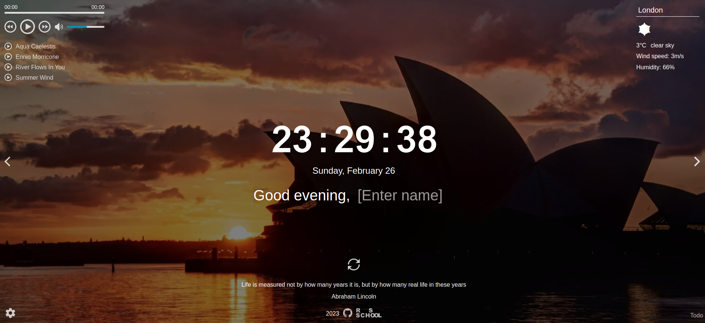

# Momentum

Analogue the Chrome Web Store app of the same name


## Deploy

https://alexpashchuk-momentum.netlify.app

## Install instructions:

```bash
1. git clone https://github.com/alexpashchuk/Momentum
2. npm i
3. npm run start
```

### Used technologies

- JavaScript
- CSS
- Rest API
- Webpack

## Screenshot


